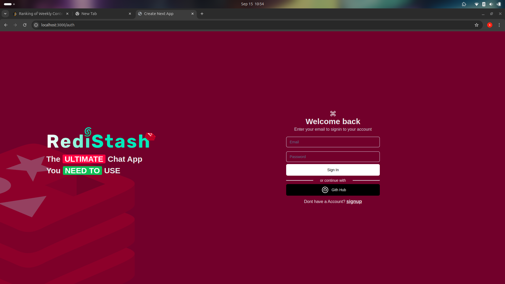

<!DOCTYPE html>
<html lang="en">
<head>
    <meta charset="UTF-8">
    <meta name="viewport" content="width=device-width, initial-scale=1.0">
    <title>Redis Chat App</title>
    
</head>
<body>

    <h1>Redis Chat App</h1>
    
Redis Chat App is a sleek and modern chat application that allows users to communicate seamlessly using real-time Redis messaging infrastructure.

    <h2>Features</h2>
    <ul>
        <li><strong>Real-Time Messaging</strong>: Instant communication with Redis for handling high-speed messaging.</li>
        <li><strong>Responsive Design</strong>: Optimized for various screen sizes.</li>
        <li><strong>Email Authentication</strong>: Sign in with email and password support.</li>
        <li><strong>Secure and Scalable</strong>: Built with security and scalability in mind using Redis as the backend.</li>
        <li><strong>Modern UI</strong>: Intuitive user interface designed with Tailwind CSS.</li>
    </ul>

    <h2>Screenshots</h2>
    <!-- Add screenshots here -->
    
    

    <h2>Tech Stack</h2>
    <ul>
        <li><strong>Frontend</strong>: Next.js, React, Tailwind CSS</li>
        <li><strong>Backend</strong>: Redis (for messaging infrastructure)</li>
        <li><strong>Authentication</strong>: Custom email authentication</li>
        <li><strong>UI Components</strong>: Custom Input, Button components</li>
    </ul>

    <h2>Installation</h2>
    
Follow these instructions to set up and run the project locally.

    <h3>Prerequisites</h3>
    <ul>
        <li>Node.js (v14+)</li>
        <li>Redis Server (v6+)</li>
    </ul>

    <h3>Setup</h3>
    <ol>
        <li>Clone the repository:</li>
        <pre><code>git clone https://github.com/your-username/redis-chat-app.git</code></pre>
        <li>Navigate to the project folder:</li>
        <pre><code>cd redis-chat-app</code></pre>
        <li>Install dependencies:</li>
        <pre><code>npm install</code></pre>
        <li>Run Redis server:</li>
        <pre><code>redis-server</code></pre>
        <li>Start the development server:</li>
        <pre><code>npm run dev</code></pre>
        <li>Visit <a href="http://localhost:3000" target="_blank">http://localhost:3000</a> in your browser to access the application.</li>
    </ol>

    <h2>Usage</h2>
    <ol>
        <li>Sign in with your email to start chatting.</li>
        <li>After signing in, enter your password to access the chat features.</li>
        <li>Use the app for real-time messaging and experience seamless communication.</li>
    </ol>

    <h2>Contributing</h2>
    
Contributions are welcome! Please open an issue or submit a pull request.

    <h2>License</h2>
    
This project is licensed under the MIT License - see the <a href="LICENSE">LICENSE</a> file for details.

</body>
</html>
